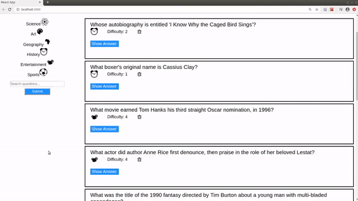
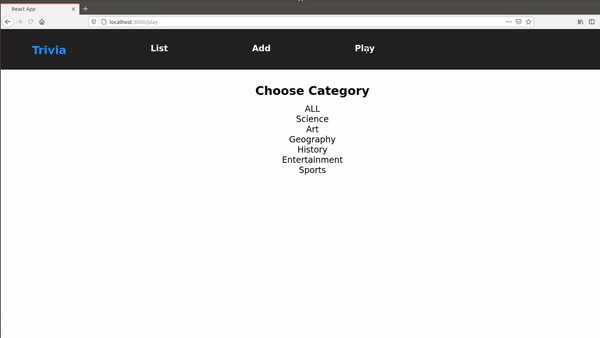
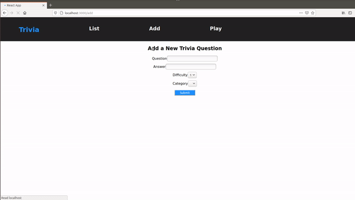

# Trivia App

## Features

1. View all questions or by category.



2. Play the quiz game.



3. Add questions.



4. Search for questions.

### Backend

API endpoints are implemented with Flask and data are stored in a PostgreSQL instance. Docker is used to containerize the application.

```bash
cd backend
docker-compose up
```

For fisrt-time setup, we need to create tables and insert some test data ourselves.

```bash
psql -h 127.0.0.1 -p 6543 -U postgres trivia < trivia.psql
```

### Frontend

Implemented with React. Install dependencies and develop locally with npm as follows.

```bash
cd frontend
npm install
npm start
```
